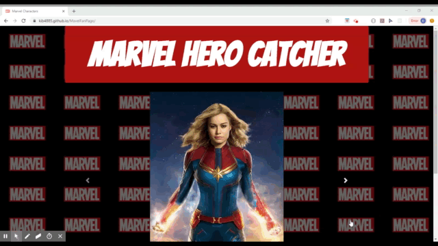
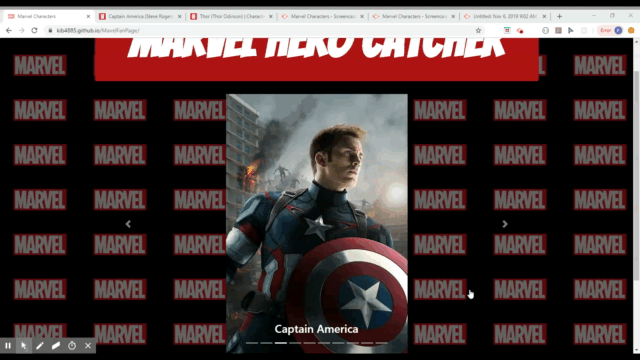
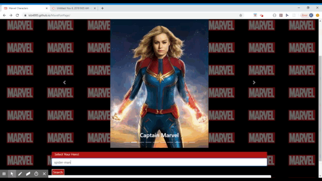
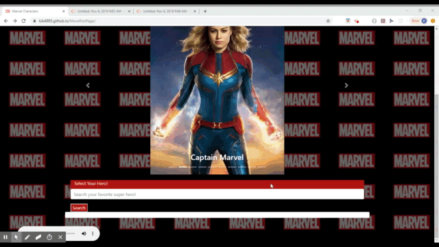

# Mavel-Fan-Page

## **LINK TO DEMO**
https://kib4885.github.io/MavelFanPage/

## **OVERVIEW**

A Marvel Fan Page.

Website was created in anticipation of Marvel's newest movie “Avengers: Endgame”.
With that in mind, we wanted to give our users a way to access character information. 
Through our site, users will be able to acquire and review character information in preparation of the movie release.

The page gives a user the ability to search any Marvel character and be able to retrieve the Character Bio, Character title movies, and Character featured and support comics. 

## **TECHNOLOGIES USED**

### **Front End:**
* **Bootstrap:**
    * Carousel
        - Shows Main Avengers Character, each image is clickable and will direct the user to the Marvels page for that Character once clicked. 

* **Jumbotron**
* **Google Scripts**
* **Modal**
    * Pop-up box @ search, will direct the user to Fandango, allowing them to purchase movie tickets

### **Back End:**
* **JavaScript/jQuery**
    * Makes ajax calls to API’s, based off user search 
    * Post the results to page 
* **API**
    * **Marvel API**
        * Character Search:  API will retrieve Character Bio and featured and support comics
    * **OMDB API**
        * Title Movie Search: API will retrieve character  movies 

* **Misc:**
    * Mobile Responsive

